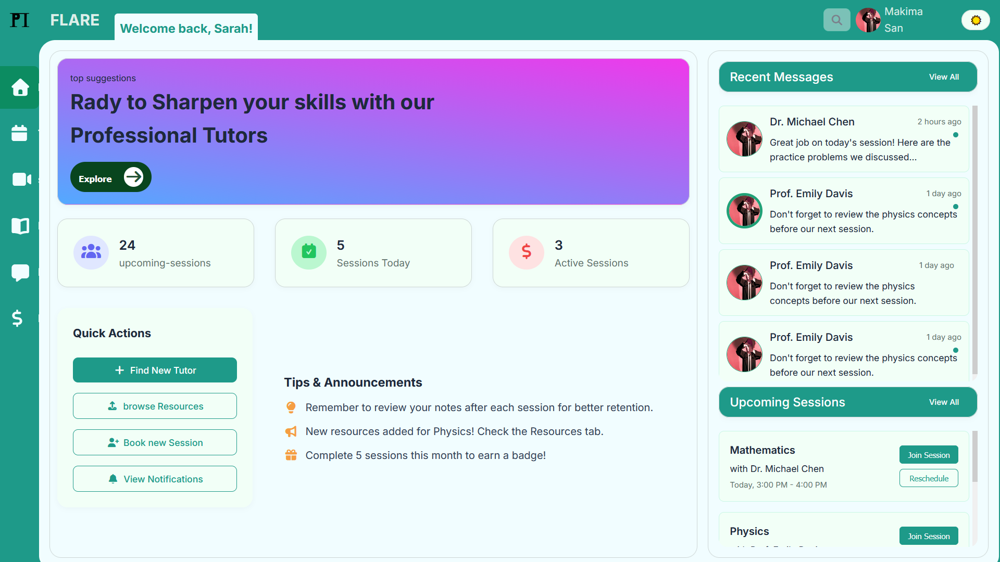
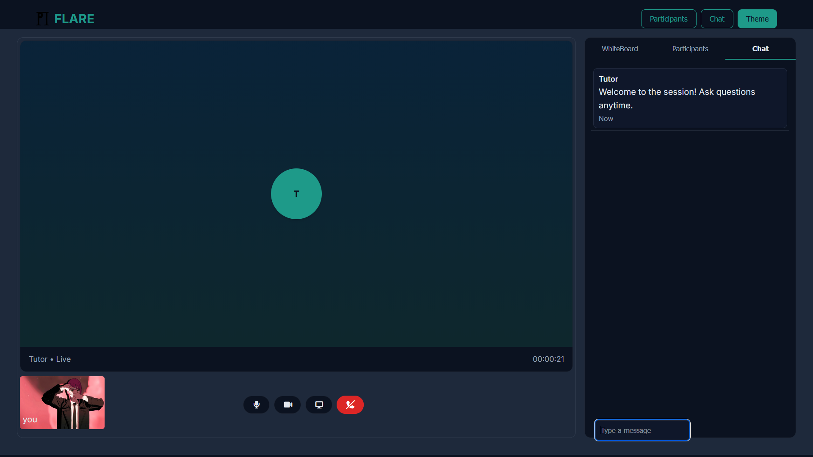

#  HomeTutorFinder — Tutoring and Study  Platform


---

### 🎯 Overview

**HomeTutorFinder** is a web-based tutoring and study aid system that connects students with qualified tutors for both **in-person** and **virtual** learning.  
It provides tutor verification, smart scheduling, secure payments via **Chapa**, **Jitsi**-powered live classes, and **Telegram** notifications for an accessible and modern learning experience.

Designed for **Ethiopian students and tutors**, it supports multi-language use (Amharic, Arabic, English) and brings transparency and reliability to the education ecosystem.

---

## ⚙️ Core Functionalities

### 👨‍🎓 Students
- Search tutors by subject, location, or rating  
- Book and schedule sessions (virtual or physical)  
- Join live classes through Jitsi  
- Make payments securely via Chapa  
- Download or view shared study materials  
- Receive in-app and Telegram notifications  
- Submit feedback and rate tutors  

### 👩‍🏫 Tutors
- Create and edit tutor profile  
- Upload qualification documents for verification  
- Manage availability with interactive calendar (FullCalendar)  
- Offer session packages with fixed duration and frequency  
- Conduct online classes using Jitsi  
- Upload study resources for students  
- Communicate via in-app chat  

### 🧑‍💼 Admin
- Verify tutor profiles and documents  
- Manage users, sessions, and disputes  
- Monitor transactions and analytics (charts, reports)  
- Handle feedback and content moderation  

---

## 🧩 Subsystems

| Subsystem | Description |
|------------|-------------|
| User Management | Registration, authentication, and roles (Student, Tutor, Admin) |
| Tutor Management | Profile, verification, and subject expertise |
| Session Management | Booking, scheduling, and progress tracking |
| Payment Management | Chapa-based transactions and tutor earnings |
| Notification System | In-app + Telegram-based notifications |
| Virtual Classroom | Online video classes via Jitsi integration |
| Resource Sharing | Upload/download of educational materials |
| Feedback & Rating | Review system linked to session completion |
| Admin Panel | Verification, analytics, and oversight |

---

## 🧱 System Architecture
**3-Tier Design:**
1. **Frontend:** HTML, CSS, JavaScript (FullCalendar.js)  
2. **Backend:** Django (Python)  
3. **Database:** SQLite (default) / MySQL (optional)

**External Integrations:**  
Chapa API (Payments) • Jitsi API (Virtual Class) • Telegram Bot API (Notifications)

---

## 🧰 Technologies Used

| Layer | Technology |
|-------------------|-------------                     |
| Frontend          | HTML, CSS, JavaScript, Bootstrap |
| Backend           | Django (Python)                  |
| Database          | SQLite / MySQL                   |
| Payment           | Chapa API                        |
| Video Conferencing | Jitsi Meet                      |
| Notifications     | Telegram Bot API                 |
| Version Control   | Git + GitHub                     |

---

## 🧠 Quick Installation

```bash
git clone https://github.com/your-username/homeTutorFinder.git
cd homeTutorFinder

python -m venv venv
venv\Scripts\activate      # On Windows

pip install -r requirements.txt

python manage.py migrate
python manage.py runserver

```
## 📸 Project Preview
| Tutor Dashboard | Session Page | Virtual Class |
|---------------|----------------|----------------|
|  |  |  |


## 📞 Contact
📧 Email: yourname@example.com  
💼 LinkedIn: [linkedin.com/in/yourname](https://www.linkedin.com/in/musab-aj-b18909394)  
🐙 GitHub: [github.com/your-username](https://github.com/MUSABAJ)

